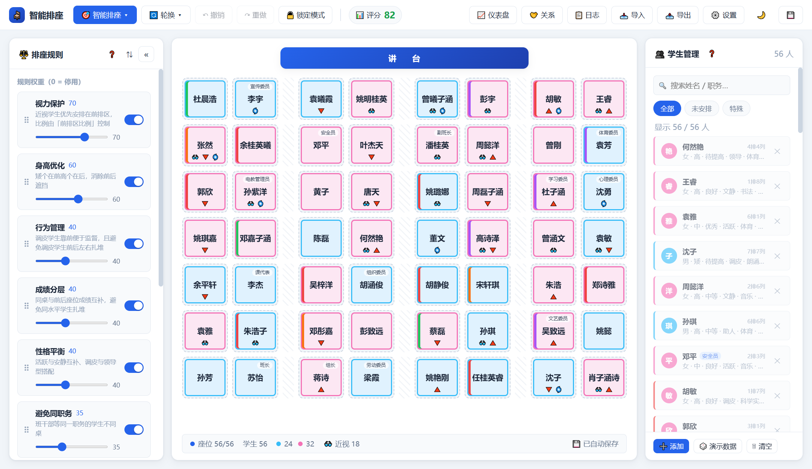

# 智能排座系统（Classroom Seating）


[English](README.md) | 简体中文



纯前端的教室座位智能编排工具：原生 JavaScript + ES Modules，零框架、无构建步骤、无后端，数据全部存在浏览器 localStorage，打开网页即可使用。

班主任只需导入学生名单、调节规则权重，系统即可在数秒内给出一份兼顾视力、身高、成绩、行为、性别、同学关系等多维度的座位表，并支持公平轮换、多方案对比、评分报告与一键导出。

## 为什么选它？

- **隐私优先**——名单永不出浏览器：无账号、无服务器、无追踪，自带本地自动备份。
- **真优化，不是随机打乱**——硬约束（锁定座位 / 好友同桌 / 黑名单隔离）+ 10 条加权软规则，爬山 × 模拟退火寻优，每份结果都有量化评分。
- **零构建、零安装**——纯静态文件，任意静态托管（GitHub Pages / Cloudflare Pages / Vercel）原样部署。
- **内置公平轮换**——五种轮换模式（左移 / 右移 / 整排后移 / 前移 / 蛇形），锁定座位受保护，附带轮换历史。
- **先对比再采用**——一次生成 N 个候选方案（不同随机种子），评分并排对比，择优一键应用。

## ✨ 功能特性

- 🎯 **智能排座**：硬约束（锁定座位 / 好友必须同桌 / 黑名单禁止相邻）+ 10 条软规则加权评分，爬山 × 模拟退火局部搜索寻优，结果量化打分
- 🏆 **多候选方案**：一次生成 N 个方案（不同随机种子），评分对比 + 迷你教室预览 + 一键应用
- 📊 **评分报告**：总分、10 维度子分条形、违规明细、硬冲突与改进建议
- 🔄 **五种轮换**：整体左移 / 右移、整排后移 / 前移、蛇形轮换；锁定座位受保护，附带轮换历史
- 🤝 **关系约束**：好友必须同桌、黑名单禁止同桌（可叠加禁止前后相邻）；不可满足时明确报告
- 🏫 **过道支持**：任意列可标记为过道（天然隔断同桌关系），内置 4 种教室模板
- 📥 **Excel 导入**：中英文表头自动识别 + 列映射预览确认，9 个字段全量导入；可下载导入模板（demo 数据 + 独立字段说明 sheet）
- 📤 **多格式导出**：Excel（双 sheet）、PNG 成品座位表（可直接打印）、JSON 完整备份
- 📈 **统计仪表盘**：性别环形图、身高 / 视力 / 成绩 / 性格分布条形图（纯 SVG）+ 行 × 列热力图
- ↩️ **撤销 / 重做**：命令模式，覆盖排座 / 交换 / 导入 / 轮换等全部操作（`Ctrl+Z` / `Ctrl+Y`）
- 🎲 **演示数据生成器**：随机中文姓名 + 合理属性分布，同种子可复现
- 🌙 暗色主题、FLIP 平滑动画、快捷键（`Ctrl+S` 保存 / `Esc` 关闭弹窗）、锁定模式

## 🚀 快速开始

项目为纯静态站点，**必须通过 HTTP 服务访问**（ES Modules 不支持 `file://` 直接打开）。

1. 克隆并在项目根目录启动本地服务：

   ```bash
   git clone https://github.com/ikoobee/classroom-seating.git
   cd classroom-seating
   python -m http.server 8000   # 或：npx serve .
   ```

2. 浏览器打开 <http://localhost:8000>
3. 点击右栏 **🎲 演示数据** 生成随机学生（或 📥 导入 Excel）
4. 顶栏 **🎯 智能排座 ▾** 一键排座，左栏调节 **10 条规则权重**（0 = 停用）与 **前排区比例**，重新排座立见效果
5. 顶栏 **🔄 轮换** 做公平轮换，**🤝 关系** 维护好友与黑名单

> 部署：直接推送到任意静态托管（GitHub Pages / Cloudflare Pages / Vercel 等），无需任何构建配置。

### 📖 文档与博客

- [使用说明](guide.html) — 三步上手、功能总览、常见问题
- [排座博客](blog.html) — 方法论文章：排座原则、公平轮换、同桌搭配、工具选型

## 🧪 测试

```bash
# 命令行无头运行单元测试（node ≥ 18）
node tests/_node.mjs
```

浏览器测试页：`tests/runner.html`（单元）· `tests/e2e.html`（E2E 冒烟）。

## 🧱 目录结构

```
classroom-seating/
├── index.html              # 唯一页面（importmap 将 @ikoobee/seating-core 指向本地包）
├── css/                    # 样式（主题变量在 base.css）
├── packages/
│   └── seating-core/       # 排座引擎独立 npm 包（@ikoobee/seating-core）
│       └── src/            # 纯逻辑层（无 DOM/IO 依赖，可独立测试）
│           ├── engine/     # 排座引擎：context/constraints/scorers/evaluate/
│           │               #   construct/moves/optimize/precheck/engine
│           ├── rotation.js # 五种轮换（循环置换，锁定保护）
│           ├── grid.js     # 网格几何（过道/同桌边/前后边/前排区）
│           └── datagen / models / constants / relations / stats / rng
├── js/
│   ├── main.js / app.js    # 入口装配 / App 协调
│   ├── store/              # 迷你 store + actions/reducers + 命令式 history
│   ├── services/           # storage（防抖+配额降级）/ logger（索引/详情分离）/
│   │                       #   arranger（排座编排）/ excel / image / backup / vendor
│   └── ui/                 # 视图（topbar/classroom/studentsPanel/rulesPanel + 模态框）、
│                           #   交互（flip/shortcuts）、组件（modal/toast/charts）
├── assets/vendor/          # xlsx（本地副本优先，加载失败回退 CDN）
└── tests/                  # runner.html 单元测试 / e2e.html 冒烟测试 / _node.mjs 无头运行
```

引擎以独立 npm 包 **`@ikoobee/seating-core`** 提供——应用自身通过 import map 引用它（站点保持零构建），第三方项目可直接依赖发布包。

## 🎯 排座引擎说明

- **硬约束**（必须满足，独立报告不扣分）：锁定座位、好友同桌、黑名单隔离（同桌/前后）
- **软规则**（权重 0-100 加权评分）：视力保护 / 身高优化 / 行为管理 / 成绩分层 / 性别平衡 / 能力互补 / 避免同职务 / 性格平衡 / 随机打散 / 前排优先
- **优化**：约束感知的初始解构造 → 爬山 + 模拟退火（单方案预算 350ms / 多方案每个 220ms），目标函数含硬冲突罚分，初始解中的冲突也会被主动修复
- **可复现**：全部随机走种子（mulberry32），同 seed 同结果，日志记录种子

## 🗄 数据与隐私

- 全部数据仅存于浏览器 `localStorage`（key 前缀 `sm.`），**不上传任何服务器**，无账号、无追踪
- 自动保存（600ms 防抖）+ 关闭页面前强制落盘 + 本地备份环（保留 5 个）+ JSON 文件备份 / 恢复
- 配额保护：超出 localStorage 限额时自动清理最旧日志详情与备份，并提示导出 JSON 兜底

## 📄 许可证

[MIT](LICENSE)

## ⭐ Pro 版

面向有更高需求的老师，存在商业版 **排座 Pro**：多班级 / 多学期档案、批量打印模板（A4 座位表与桌贴姓名条）、区域约束、规则预设。它基于同一引擎（`@ikoobee/seating-core`），采用可持续的 open-core 模式。

**免费版现有功能永久保留**——Pro 只在其上叠加能力，不会有任何功能被上锁或收回。

## ☕ 赞赏支持

智能排座永久免费。如果它帮你省下了一节晚自习的时间，欢迎请作者喝杯咖啡：

<p align="center">
  
  
</p>

## 🙏 致谢

- [SheetJS (xlsx) 0.18.5](https://sheetjs.com) — Apache-2.0 许可证。本地副本（`assets/vendor/`）优先加载、失败回退 CDN，用于 Excel 导入导出。
